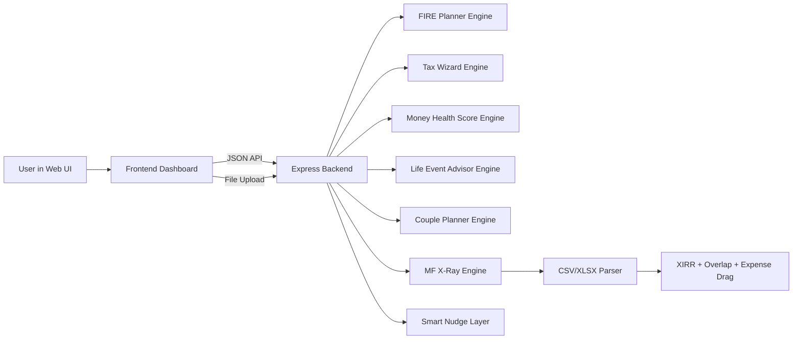

# Architecture (AI Money Mentor)

## 1) High-Level Diagram

## 2) Agent/Module Roles

- **Input Normalizer**: Converts UI/file inputs into validated numeric payloads.
- **Computation Engines**:
  - FIRE: corpus target + SIP glidepath by month
  - TAX: old/new regime slab tax and deduction gaps
  - HEALTH: weighted 6-dimension financial wellness score
  - LIFE: event-triggered allocation strategy
  - COUPLE: combined net worth + tax-aware SIP split
  - X-RAY: portfolio reconstruction + XIRR + overlap + drag + rebalancing
- **Recommendation Layer**: Emits plain-language recommendations and nudges.

## 3) Communication and Flow

1. User enters/updates data in frontend cards.
2. Frontend calls corresponding backend endpoint.
3. Backend runs deterministic calculators and returns JSON.
4. Frontend renders readable JSON for traceable hackathon judging.

## 4) Error Handling

- Missing file upload for MF X-Ray returns `400`.
- Safe numeric defaults prevent NaN propagation.
- CORS enabled for local frontend/backend origins.
- Calculation steps are structured and inspectable in response payloads.

## 5) Why This Design

- Modular calculators allow independent upgrades per feature.
- Deterministic backend makes output verifiable (important for tax/FIRE scoring rubric).
- Single dashboard minimizes demo friction in 3-minute pitch walkthrough.
